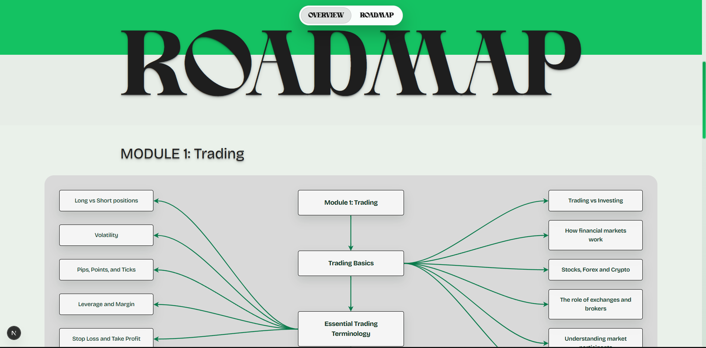
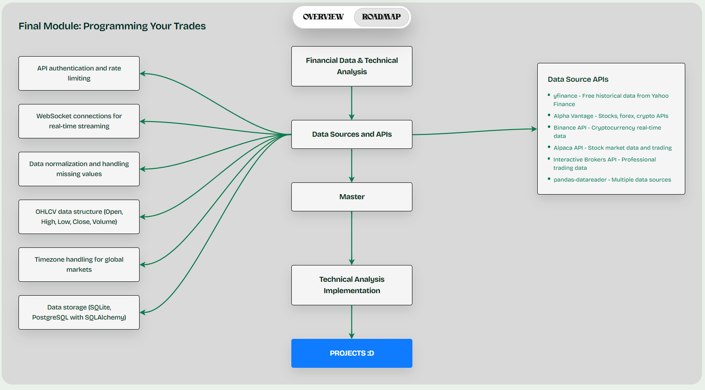

## AlgoTeen

AlgoTeen is a Next.js learning platform that teaches teens how to trade safely. The site mixes trading fundamentals, programming roadmaps, and practice projects. Static content lives in the App Router, styling is handled with Tailwind utilities, and interactive diagrams use `react-xarrows`.

## Features

- Landing page with hero, strategy tracks, and pricing sections
- Learn page that includes the trading and programming roadmap diagram
- Interactive node details with searchable resources and project ideas
- Header search that jumps to any page section and the AlgoTeen wordmark routing home
- Code Lab workspace for backtesting trading strategies

## Backtesting

AlgoTeen includes an interactive code editor for testing trading strategies using historical market data. Access it at `/codelab`.

### Strategy Format

Your strategy must be a JavaScript function named `strategy` that takes these parameters:
```javascript
function strategy({ data, index, price, helpers, state }) {
  // Your strategy logic here
}
```

### Return Actions

The function must return an object with an `action` property. Valid actions are:
- `'buy'` - Open a long position
- `'sell'` - Open a short position  
- `'exit'` - Close an existing position
- `'hold'` - Do nothing

Optional properties:
- `size` - Position size configuration (see Position Sizing below)
- `stopLoss` - Stop-loss percentage (e.g., 5 for 5% stop)
- `takeProfit` - Take-profit percentage (e.g., 10 for 10% target)
- `note` - Descriptive string for logging

### Available Helpers

The `helpers` object provides technical indicators:
- `helpers.ema(data, index, length)` - Exponential moving average
- `helpers.sma(data, index, length)` - Simple moving average  
- `helpers.rsi(data, index, length)` - Relative Strength Index
- `helpers.highest(data, index, length, accessor)` - Highest value in window
- `helpers.lowest(data, index, length, accessor)` - Lowest value in window

### State Access

The `state` object provides read-only access to:
- `state.positionSize` - Current position size (0 if no position, negative for short)
- `state.entryPrice` - Entry price of current position
- `state.cash` - Available cash
- `state.equity` - Current equity value
- `state.stopLoss` - Current stop-loss price (if set)
- `state.takeProfit` - Current take-profit price (if set)

### Realistic Trading Simulation

The backtesting engine now simulates real trading conditions:

- **Transaction Costs**: Configurable commissions (per trade, per share, percentage)
- **Slippage**: Realistic price impact on order execution
- **Market Orders**: Orders execute at simulated market prices with spread
- **Risk Management**: Built-in stop-loss and take-profit support
- **Position Limits**: Only one position at a time (like most retail accounts)

### Position Sizing

The backtesting engine supports portfolio-based position sizing:

- **Percentage-based sizing**: Deploy a percentage of available capital
  ```javascript
  return { action: 'buy', size: { type: 'percentage', value: 20 } }; // 20% of capital
  ```
- **Fixed share sizing**: Specify exact number of shares
  ```javascript
  return { action: 'buy', size: { type: 'fixed', value: 100 } }; // 100 shares
  ```
- **Default**: 10% of capital if no size specified

### Risk Management

Add stop-loss and take-profit to protect your capital:

```javascript
return {
  action: 'buy',
  size: { type: 'percentage', value: 15 },
  stopLoss: 5,    // 5% stop-loss
  takeProfit: 10, // 10% take-profit
  note: 'Protected long position'
};
```

### Example Strategy

```javascript
function strategy({ data, index, price, helpers, state }) {
  const fast = helpers.ema(data, index, 8);
  const slow = helpers.ema(data, index, 21);
  const rsi = helpers.rsi(data, index, 14);

  if (fast === null || slow === null || rsi === null) {
    return { action: 'hold' };
  }

  const uptrend = fast > slow;
  const exitSignal = rsi >= 70;

  if (uptrend && state.positionSize === 0) {
    return {
      action: 'buy',
      size: { type: 'percentage', value: 20 },
      stopLoss: 5,
      takeProfit: 15,
      note: 'Fast EMA crossed above slow EMA'
    };
  }

  if (state.positionSize > 0 && exitSignal) {
    return { action: 'exit', note: 'RSI stretched into overbought' };
  }

  return { action: 'hold' };
}
```

This momentum strategy uses trend-following with risk management, deploying 20% of capital per trade with 5% stop-loss and 15% take-profit targets.

### Getting Started with Backtesting

1. Navigate to `/codelab` in your browser
2. Select an asset class (Stocks, Forex, or Crypto) and symbol
3. **Choose appropriate timeframe**: Daily data works best for most strategies, intraday data increases transaction costs
4. Choose a date range with sufficient historical data (at least 1 year for reliable results)
5. Click "Load market data" to fetch historical bars
6. Write or modify your strategy in the code editor
7. Click "Run backtest" to execute your strategy

The backtesting engine simulates real trading with $10,000 starting capital, commissions, slippage, and position sizing.
- **No risk management**: No built-in stop-losses or risk-based position sizing

**Example with custom sizing:**
```javascript
return { action: 'buy', size: 10, note: 'Buying 10 shares' };
```

**To buy with available cash:**
```javascript
// Buy as many shares as possible with all available cash
const maxShares = Math.floor(state.cash / price);
return { action: 'buy', size: maxShares, note: 'Full position' };
```

### Troubleshooting

**Seeing 0% returns?** This usually means:
- No market data loaded (check the "Load market data" button)
- Strategy conditions are too restrictive (try the swing channel example)
- Time period has no volatility (try a different date range)
- Strategy only holds positions at the end (backtester auto-closes at end of data)

**Tiny profits/losses on every trade?** This indicates:
- **Overtrading**: Strategy opens/closes positions too frequently (try wider bands or daily data)
- **Transaction costs**: Small moves get eaten by fees (use larger position sizes or longer holds)
- **Wrong timeframe**: Hourly data creates noise; daily data works better for most strategies

**No trades generated?** Check:
- Indicator calculations return `null` for early bars (add null checks)
- Entry conditions are never met for your dataset
- Strategy logic has syntax errors (check console for errors)

## Screenshots


_Roadmap title area with the trading module nodes._


_Programming roadmap section highlighting the automation modules._


_Landing page slice that introduces the Build Code workspace._

## Tech Stack

- Next.js App Router
- React 19
- Tailwind CSS utility classes (`src/app/globals.css`)
- react-xarrows for the roadmap connectors
- Google Fonts via `next/font`
- Custom Fonts in /fonts

## Getting Started

Install dependencies and run the development server:

```bash
npm install
npm run dev
```

Open http://localhost:3000 to view the app. The Learn roadmap is available at http://localhost:3000/learn.

### Database Setup

AlgoTeen uses Supabase for authentication and data storage. To set up the database:

1. Create a new Supabase project at [supabase.com](https://supabase.com).
2. Go to the SQL Editor in your Supabase dashboard.
3. Run the setup script to generate the complete SQL:

   ```bash
   ./scripts/setup.sh
   ```

4. Copy the output and paste it into the SQL Editor, then run it.

This creates all necessary tables with proper relationships, indexes, and constraints.

Set your environment variables in `.env.local`:

```
NEXTAUTH_SECRET=your-secret-here
SUPABASE_URL=your-supabase-url
SUPABASE_SERVICE_ROLE_KEY=your-service-role-key
ALPACA_API_KEY=your-alpaca-api-key
ALPACA_SECRET_KEY=your-alpaca-secret-key
ALPACA_ACCOUNT_URL=https://paper-api.alpaca.markets/v2/account
# ... other Alpaca env vars as needed
```

## Project Structure

```
src/
	app/
		layout.js      # Root layout and font wiring
		page.js        # Landing page content
		learn/page.js  # Learn roadmap screen
	components/
		RoadmapDiagram.js  # Trading and programming roadmap
		SiteHeader.js      # Shared header with search dropdown
		SiteFooter.js      # Shared footer
	data/
		searchIndex.js     # Search entries used by the header
```

Global styles, color variables, and Tailwind utilities are defined in `src/app/globals.css`.

## License

MIT License. See `LICENSE` for the full text.
